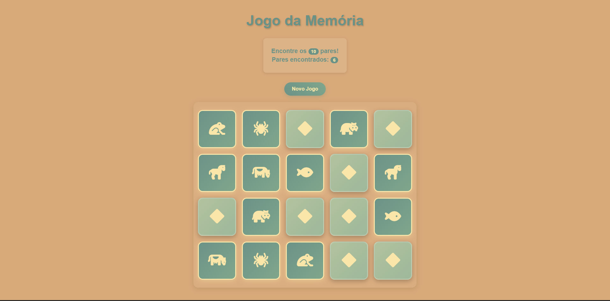

# Memory Card Game / EN

Interactive memory game that challenges players to find matching pairs. This game was a great challenge in the stage I was within my studies, but helped me understand a lot and I liked the final result. I can still refine it and make it harder with more cards, but this is going to be for another moment.

Links

- Play Now: https://fredericwithc.github.io/Jogo-da-Memoria/
- Repository: https://github.com/fredericwithc/Jogo-da-Memoria

About

A classic memory card game where players flip cards to find matching pairs. Built to practice JavaScript logic, animations, and event handling, along with CSS and HTML good practices.

Features

- Card flip animations
- Match detection
- Win condition with celebration
- Restart game option
- Smooth transitions and effects

Technologies

- HTML5
- CSS3
- JavaScript

Key Learnings

- Dynamic HTML generation using template literals
- Event listener attachment and DOM manipulation
- Boolean flags for controlling game flow (isChecking)
- Array-based tracking of temporary state (flippedCards)
- Coordinating multiple state variables for complex interactions
- Strategic use of setTimeout for user experience
- Mobile-first approach to responsive development
- CSS Grid for dynamic card layout (4x5 mobile, 5x4 desktop)
- Media queries for breakpoint-based styling
- CSS 3D transforms for card flip effects (rotateY)
- Backface-visibility for hiding card backs
- Simple shuffling algorithm with random swaps

Contact

Frederic Leyenberger

Linkedin: https://www.linkedin.com/in/frederic-leyenberger/

------------------------------------------------------------------------------------------------------------------

# Jogo da Memória / PT-BR

Jogo de Memória interativo que desafia os jogadores a encontrar pares correspondentes. Este jogo foi um grande desafio no momento que estava nos meus estudos, mas me ajudou a entender muito e gostei do resultado final. Ainda tem coisa para refinar e dá pra fazer mais difícil com mais cartas, mas isso fica pra um outro momento.

Links

- Jogar Agora: https://fredericwithc.github.io/Jogo-da-Memoria/
- Repositório: https://github.com/fredericwithc/Jogo-da-Memoria

Sobre

Um jogo clássico de cartas da memória onde os jogadores viram cartas para encontrar pares correspondentes. Construído para praticar lógica JavaScript, animações e manipulação de eventos, juntamente com boas práticas de CSS e HTML.

Funcionalidades

- Animações de virar cartas
- Detecção de pares
- Condição de vitória com celebração
- Opção de reiniciar o jogo
- Transições e efeitos suaves

Tecnologias

- HTML5
- CSS3
- JavaScript

Principais Aprendizados

- Geração dinâmica de HTML usando template literals
- Anexação de event listeners e manipulação do DOM
- Flags booleanas para controlar o fluxo do jogo (isChecking)
- Rastreamento de estado temporário baseado em arrays (flippedCards)
- Coordenação de múltiplas variáveis de estado para interações complexas
- Uso estratégico de setTimeout para experiência do usuário
- Abordagem Mobile-first para desenvolvimento responsivo
- CSS Grid para layout dinâmico de cartas (4x5 mobile, 5x4 desktop)
- Media queries para estilização baseada em breakpoints
- Transformações 3D CSS para efeitos de virar cartas (rotateY)
- Backface-visibility para esconder o verso das cartas
- Algoritmo simples de embaralhamento com trocas aleatórias

Contato

Frederic Leyenberger

Linkedin: https://www.linkedin.com/in/frederic-leyenberger/
